# java Regex Summary

##### What is Java Regular Expressions?
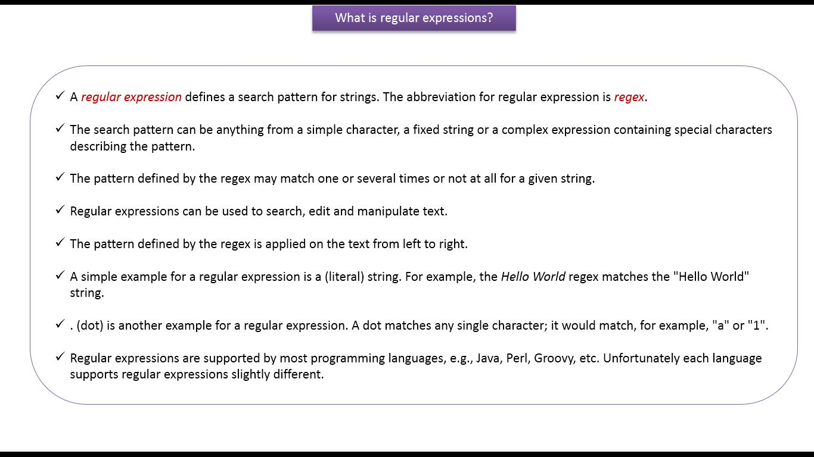
---

##### What are the Common matching symbols in Java Regex?
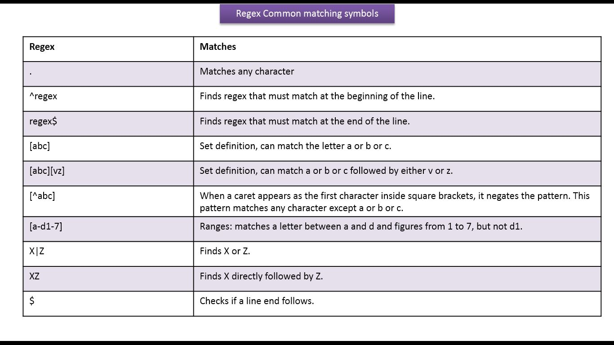
---

##### What are the Regex Meta Characters?
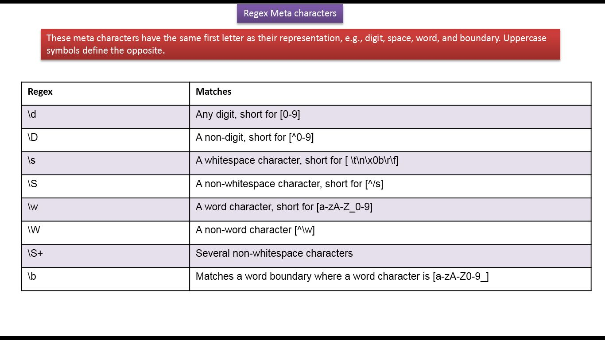
---

##### What are Regex quantifiers and examples?
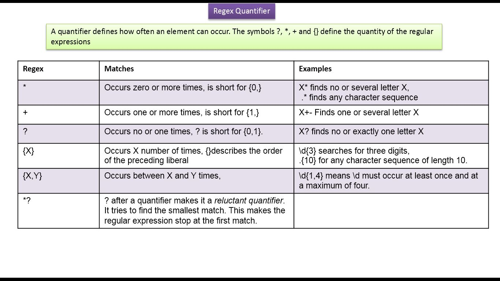

##### What are the String methods which support Java Regex?
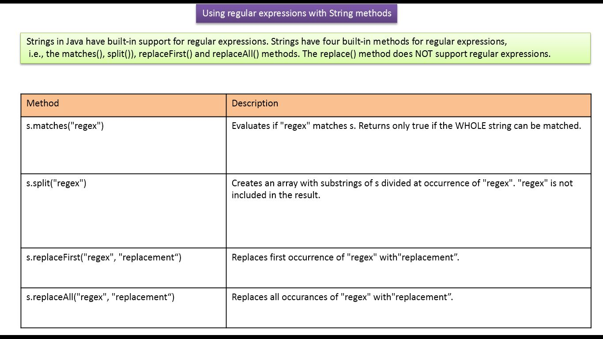
---

##### What are Java Regular Expressions and how to use pattern class?
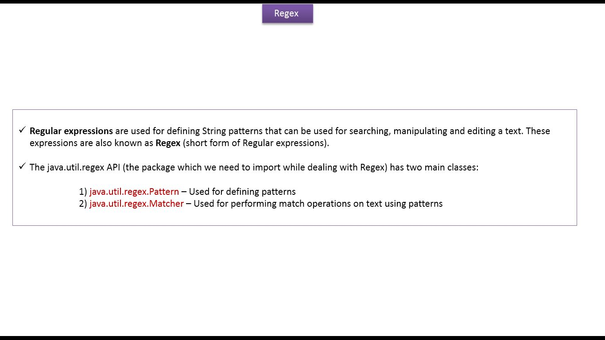
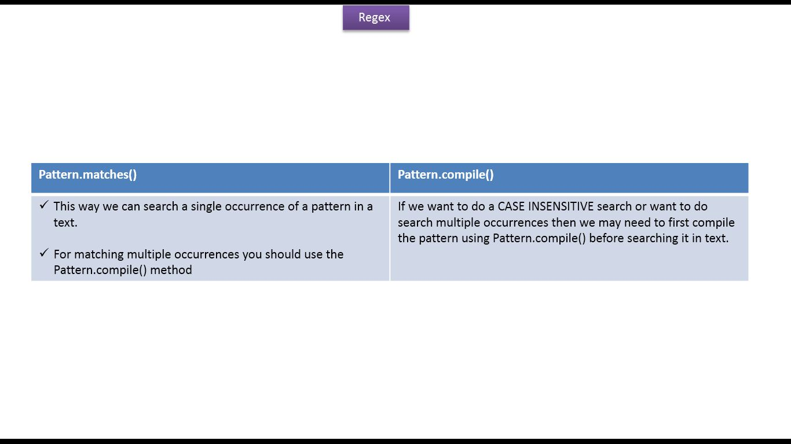
---

##### How to write a regex to validate the username?
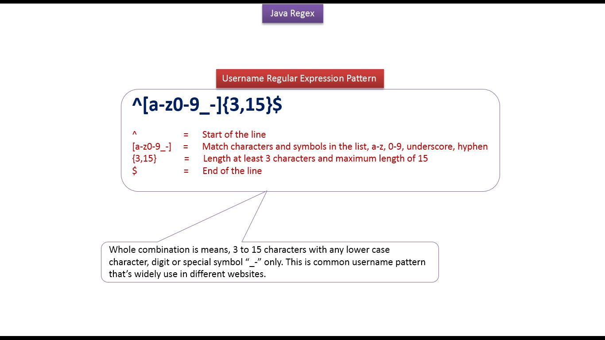
---

##### How to write a regex to validate the password?
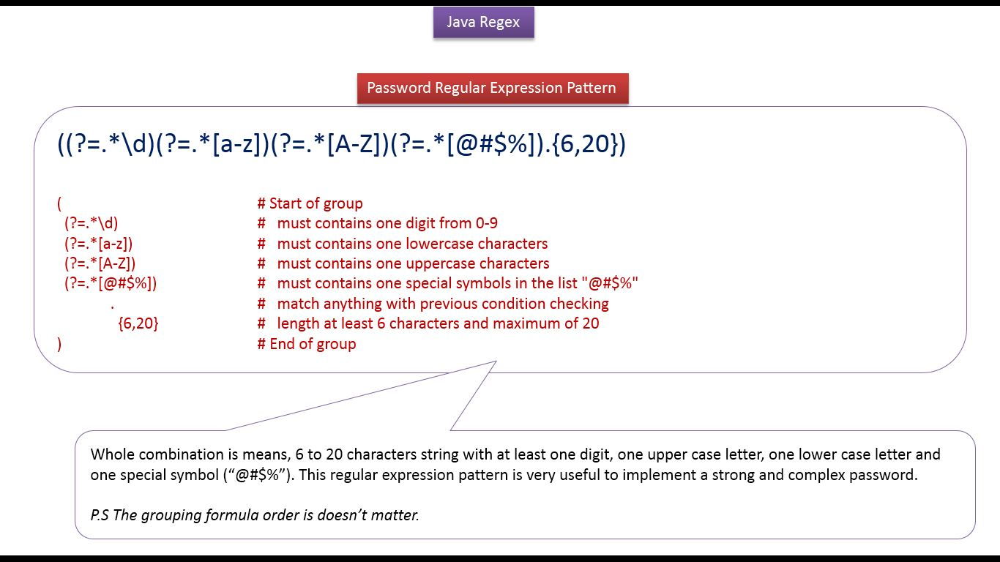
---

##### How to write a regex to validate the image name?
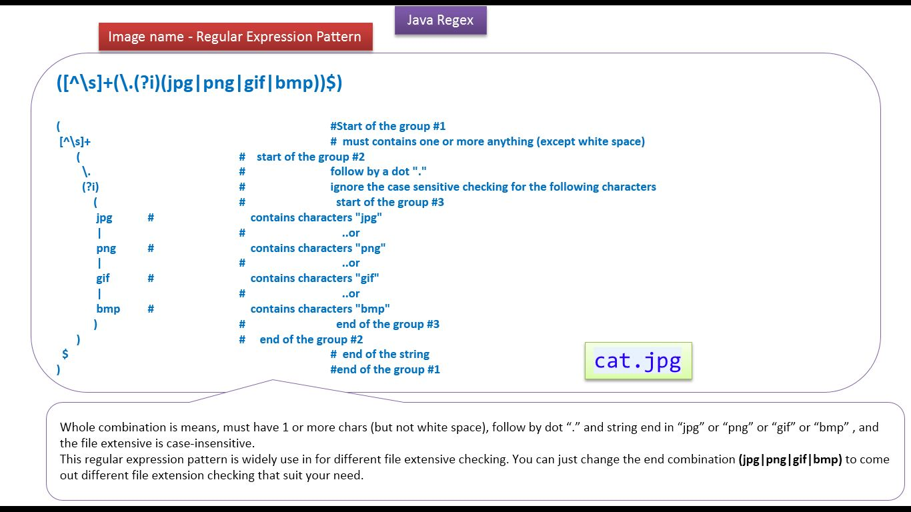
---

##### How to write a regex to validate the IP Address?
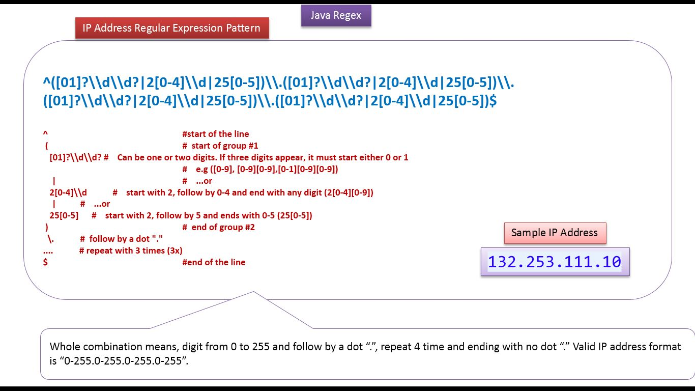
---

##### HHow to write a regex to validate the 12-hour time format?
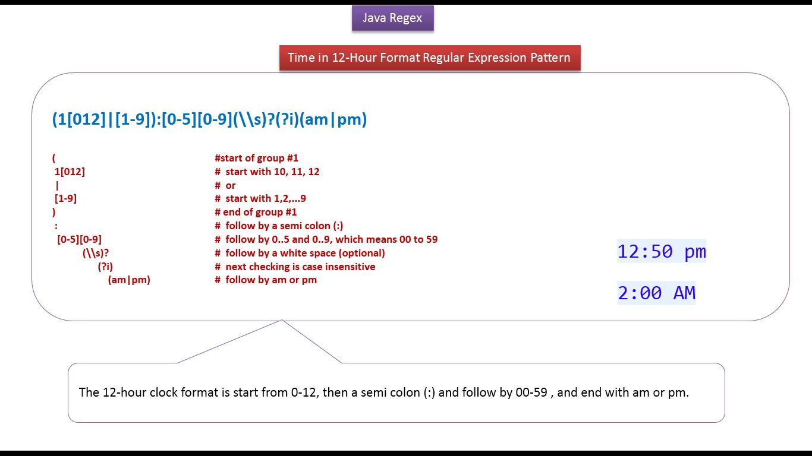
---

##### HHow to write a regex to validate the 12-hour and 24-hour time format?

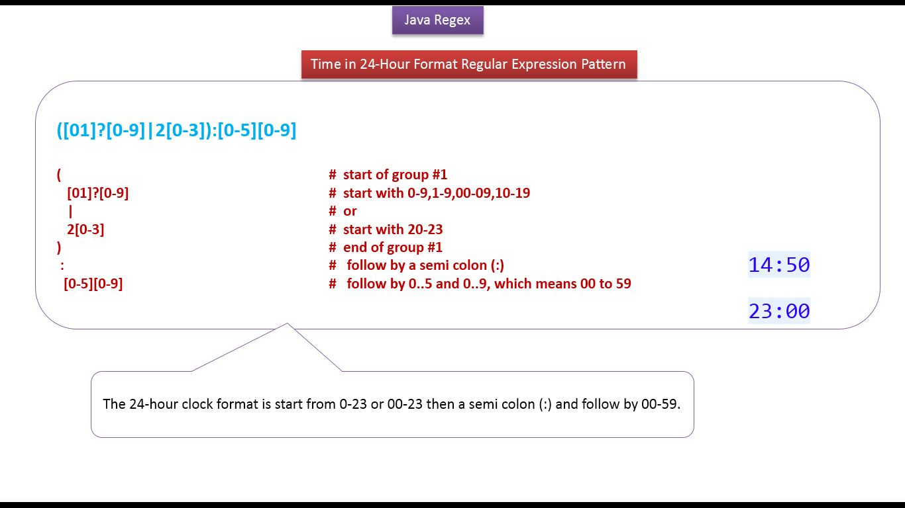
---

##### Summary?
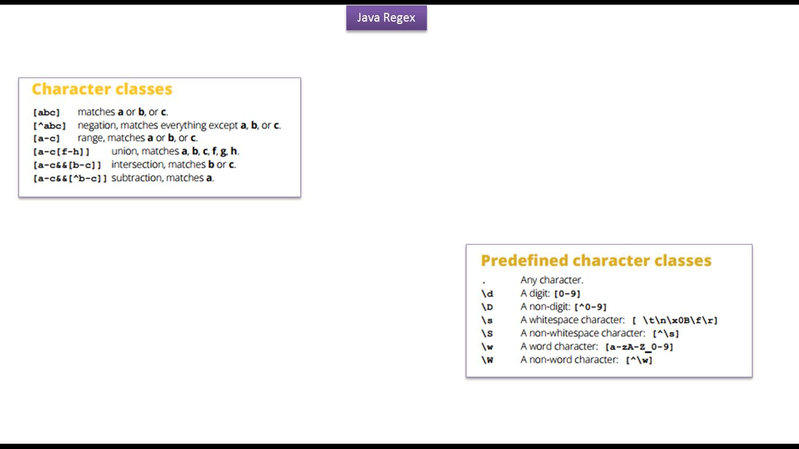
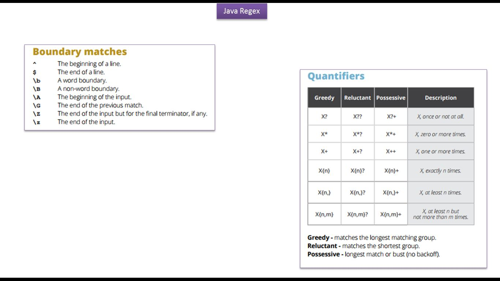
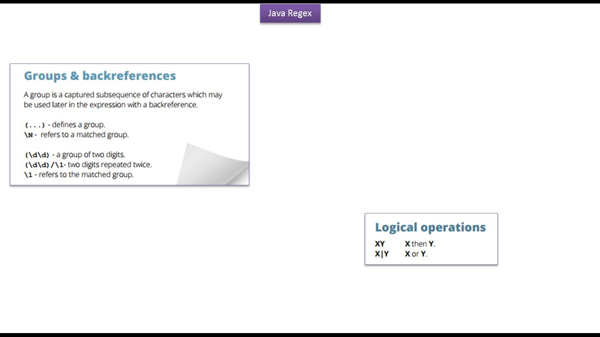
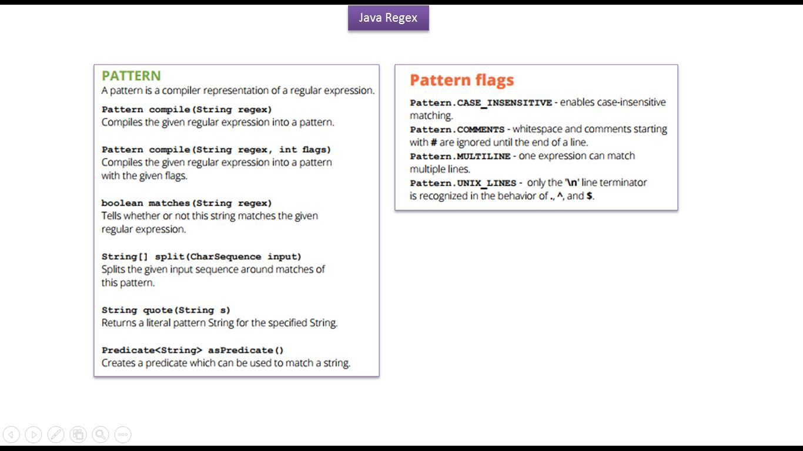
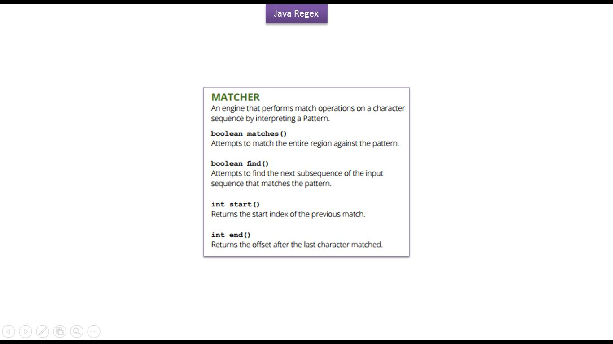
---

